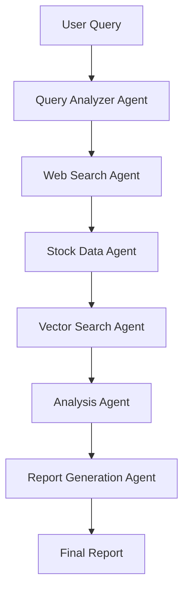

# 🚀 Multi-Agent Financial Research System

A clean, production-ready autonomous financial research system using **LangGraph** for multi-agent orchestration.

[](https://finance-agent-chapter247.streamlit.app/)

🌐 **Live Demo:** [https://finance-agent-chapter247.streamlit.app/](https://finance-agent-chapter247.streamlit.app/)

## 🏗️ Architecture



### 6 Specialized Agents:

1. **Query Analyzer Agent** - Extracts companies, time periods, and analysis type
2. **Web Search Agent** - Searches for financial news via DuckDuckGo
3. **Stock Data Agent** - Fetches historical data from Alpha Vantage
4. **Vector Search Agent** - Queries Pinecone knowledge base
5. **Analysis Agent** - Synthesizes data and creates comparisons
6. **Report Generation Agent** - Produces final structured output

## ✨ Key Features

- ✅ **State Management**: Uses `TypedDict` to pass data between agents
- ✅ **Conditional Routing**: Intelligent flow control
- ✅ **Tool Integration**: Web search, stock APIs, vector DB
- ✅ **Error Handling**: Graceful fallbacks at each stage
- ✅ **Structured Output**: Markdown tables + narrative summaries
- ✅ **Single File**: Clean, maintainable architecture

## 🚀 Quick Start

**🎯 Try it now:** [https://finance-agent-chapter247.streamlit.app/](https://finance-agent-chapter247.streamlit.app/)

**🚀 Deployed on:** Streamlit Cloud

### 1. Install Dependencies

```bash
pip install -r requirements_clean.txt
```

### 2. Set Environment Variables

Create a `.env` file:

```env
GROQ_API_KEY=your-groq-api-key
PINECONE_API_KEY=your-pinecone-api-key
ALPHA_VANTAGE_API_KEY=your-alpha-vantage-key
```

### 3. Run the System

**Command Line:**
```bash
python multi_agent_financial_system.py "Compare Apple and Microsoft revenue"
```

**Interactive Demo:**
```bash
python demo_clean.py
```

## 📊 Example Output

```markdown
# Financial Analysis Report
Generated: 2024-10-27 15:30

## 📊 Performance Comparison

| Company | Current Price | Change  | High    | Low     | Avg Volume    |
|---------|--------------|---------|---------|---------|---------------|
| AAPL    | $178.85      | +48.21% | $199.62 | $124.17 | 57,543,209    |
| MSFT    | $378.85      | +55.42% | $384.52 | $241.51 | 23,844,591    |

## 💡 Key Insights

1. Microsoft showed stronger growth (55.42%) compared to Apple (48.21%)
2. Both companies demonstrated resilience in volatile markets
3. Trading volumes indicate sustained investor interest

## 📈 Market Trends

- Tech sector continues to outperform broader market
- AI investments driving revenue growth
- Cloud services remain key growth driver

## ⚠️ Investment Considerations

- Valuation metrics at historical highs
- Regulatory scrutiny increasing
- Currency fluctuations may impact international revenue
```

## 🛠️ Customization

### Add New Agents

```python
def custom_agent(state: ResearchState, services: Dict) -> ResearchState:
    """Your custom agent logic"""
    # Process state
    state["custom_data"] = your_analysis
    return state

# Add to workflow
workflow.add_node("custom", lambda state: custom_agent(state, services))
```

### Change LLM Provider

```python
# Replace Groq with OpenAI
from langchain_openai import ChatOpenAI
llm = ChatOpenAI(model="gpt-4", temperature=0.1)
```

### Add Data Sources

```python
# Add Yahoo Finance
import yfinance as yf
stock = yf.Ticker(symbol)
info = stock.info
```

## 🔧 Configuration

### Adjust Agent Behavior

Each agent can be configured:

```python
# In analysis_agent()
prompt = f"""Perform a {style} analysis with focus on {metrics}"""

# In report_generation_agent()
report_format = "detailed" | "summary" | "executive"
```

### Vector Store Settings

```python
# Pinecone index configuration
pc.create_index(
    name="financial-research",
    dimension=768,  # Embedding size
    metric='cosine',
    pods=1,  # For paid plans
    replicas=1
)
```

## 📝 API Keys

### Free Tier Options:

- **Groq**: Free tier available at [console.groq.com](https://console.groq.com)
- **DuckDuckGo**: No API key required
- **Alpha Vantage**: Free tier at [alphavantage.co](https://www.alphavantage.co/support/#api-key)
- **Pinecone**: Free tier at [pinecone.io](https://www.pinecone.io)

### Production Setup:

For production use, consider:
- Rate limiting
- Caching responses
- Error retry logic
- Monitoring and logging

## 🌐 Deployment

**Live Application:** [https://finance-agent-chapter247.streamlit.app/](https://finance-agent-chapter247.streamlit.app/)

### Deploy Your Own Copy

1. **Fork this repository**
2. **Connect to Streamlit Cloud** at [share.streamlit.io](https://share.streamlit.io)
3. **Add your API keys** in Streamlit Cloud settings
4. **Deploy!**

The app will be live at: `https://your-app.streamlit.app`

## 🧪 Testing

```bash
# Run tests
python -m pytest tests/

# Test individual agents
python -c "from multi_agent_financial_system import query_analyzer_agent; print('✅ Import successful')"
```

## 🤝 Contributing

1. Fork the repository
2. Create your feature branch
3. Commit your changes
4. Push to the branch
5. Create a Pull Request

## 📄 License

MIT License - feel free to use in your projects!

## 🙏 Acknowledgments

Built with:
- [LangChain](https://langchain.com) - LLM orchestration
- [LangGraph](https://github.com/langchain-ai/langgraph) - Multi-agent workflows
- [Groq](https://groq.com) - Fast LLM inference
- [Pinecone](https://pinecone.io) - Vector database
- [Alpha Vantage](https://alphavantage.co) - Financial data

---

---

**Note**: This is a demonstration system. For production use, add proper error handling, rate limiting, and data validation.

🌐 **Access Live Demo:** [https://finance-agent-chapter247.streamlit.app/](https://finance-agent-chapter247.streamlit.app/)

# finance-agent
